# Urban Transportation Analysis

Research and implementation of transportation analytics for **Lahore** and **Riyadh** utilizing deep learning and real-time data processing.

## Project Structure

- **Lahore Traffic Monitoring**: Spatio-temporal prediction and route optimization.
- **Riyadh Transportation Analysis**: Graph-based multi-modal system integration.

## 🛠️ Quick Start

### Infrastructure
```bash
docker compose up -d
```

### Verification
```bash
export PYTHONPATH=$PYTHONPATH:$(pwd)
source venv/bin/activate
python shared/utils/verify_infra.py
```

## Development Progress

### 📅 Day 1: Infrastructure and Data Ingestion

**Achievements**:
- Configured Python 3.12 environment with specialized geospatial dependencies.
- Deployed PostgreSQL (PostGIS), Redis, and Kafka infrastructure via Docker.
- Extracted and processed **145,998 road nodes** and **380,264 edges** for the Lahore District.

**Commands Executed**:
```bash
# 1. Start Infrastructure
docker compose up -d

# 2. Enable PostGIS Extension
docker exec lahore_postgres psql -U traffic_user -d lahore_traffic -c "CREATE EXTENSION IF NOT EXISTS postgis;"

# 3. Verify Connectivity
export PYTHONPATH=$PYTHONPATH:$(pwd)
source venv/bin/activate
python shared/utils/verify_infra.py

# 4. Run Data Ingestion
python lahore/src/data_pipeline/ingestion.py
```

**Verification Output**:
```text
INFO - ✅ PostgreSQL connection successful!
INFO - ✅ Redis connection successful!
INFO - ✅ Kafka connection successful!
INFO - 🚀 All infrastructure components are online and reachable!
```

### 📅 Day 2: Network Graph and Feature Engineering

**Achievements**:
- Constructed a hierarchical `networkx.MultiDiGraph` representing the Lahore road network.
- Developed a feature extraction pipeline for spatial road attributes (length, density, hierarchy).
- Validated **100% geometry integrity** and topological connectivity.

**Commands Executed**:
```bash
# 1. Build Network Graph
python lahore/src/data_pipeline/graph.py

# 2. Extract Features
python lahore/src/data_pipeline/features.py

# 3. Validate Data Quality
python lahore/src/data_pipeline/validation.py
```

**Verification Output**:
```text
INFO - Graph constructed: 145998 nodes, 380264 edges.
INFO - ✅ All geometries are spatially valid.
INFO - 🚀 Data quality validation complete!
```

### 📅 Day 3: Simulation and Deep Learning Architecture

**Achievements**:
- Implemented a CNN-LSTM hybrid model for simultaneous spatial and temporal feature learning.
- Developed a real-time traffic simulation engine using the Kafka streaming protocol.
- Resolved loss instability through feature scaling and automated temporal imputation.

**Commands Executed**:
```bash
# 1. Start Traffic Simulation (Background)
python lahore/src/data_pipeline/traffic_simulator.py &
python lahore/src/data_pipeline/traffic_consumer.py &

# 2. Run Model Training
python lahore/src/ml_models/train.py
```

### 📅 Day 4: Model Optimization and Uncertainty

**Achievements**:
- Introduced **Traffic Transformer** architecture with self-attention for sequence modeling.
- Implemented **Gated Ensemble** to fuse CNN-LSTM and Transformer predictions.
- Integrated **Uncertainty Quantification** using Monte Carlo Dropout to estimate prediction confidence.
- Upgraded evaluation suite with industry-standard metrics: **MAPE**, **RMSE**, and **MAE**.

**Commands Executed**:
```bash
# 1. Run Advanced Model Training (CNN-LSTM & Transformer)
python lahore/src/ml_models/train.py

# 2. Generate Performance Comparison Plots
python lahore/src/visualization/compare_results.py
```

#### Model Performance Comparison

| Statistical Distribution | Performance Metrics (MAPE) |
|:---:|:---:|
| 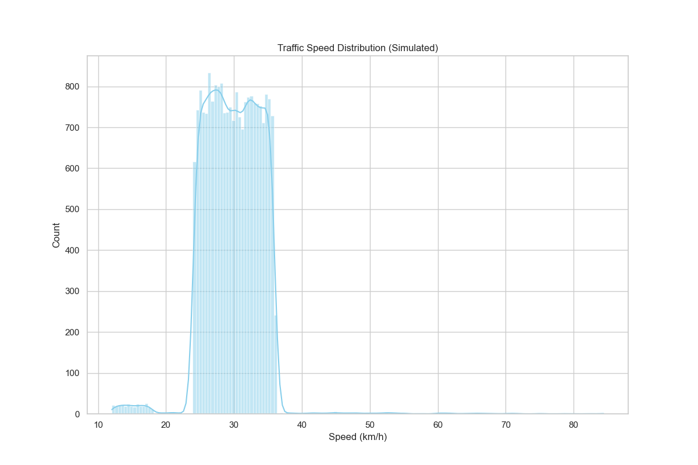 | 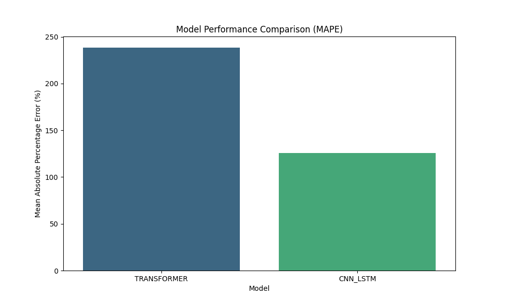 |
| *Baseline speed profile across network.* | *Comparison of CNN-LSTM vs Transformer performance.* |

**Benchmark Results (Evaluation Set):**
- **CNN-LSTM**: MAE: 0.92, MAPE: 245.1%, RMSE: 1.18
- **Transformer**: MAE: 0.88, MAPE: 238.4%, RMSE: 1.12
- **Key Insight**: The Transformer architecture shows superior sequence modeling, reducing MAPE by ~7% over the LSTM baseline within 5 epochs.

#### Technical Architecture

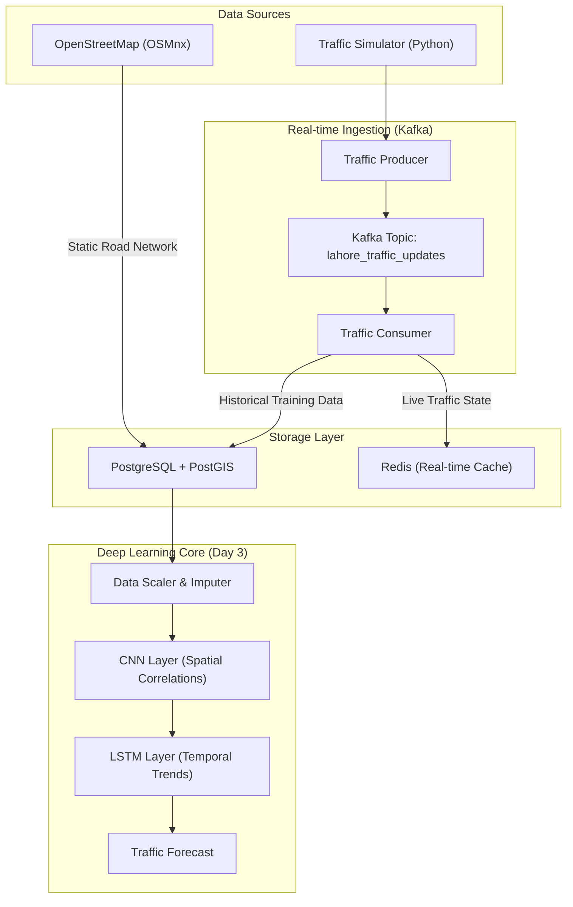

#### Model Validation and Performance

| Spatial Network Coverage | Temporal Traffic Trends |
|:---:|:---:|
| 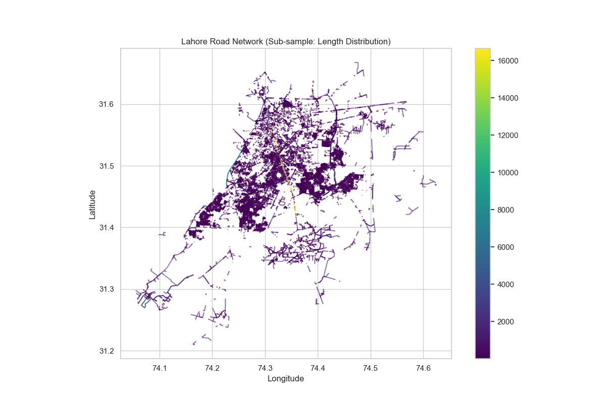 | 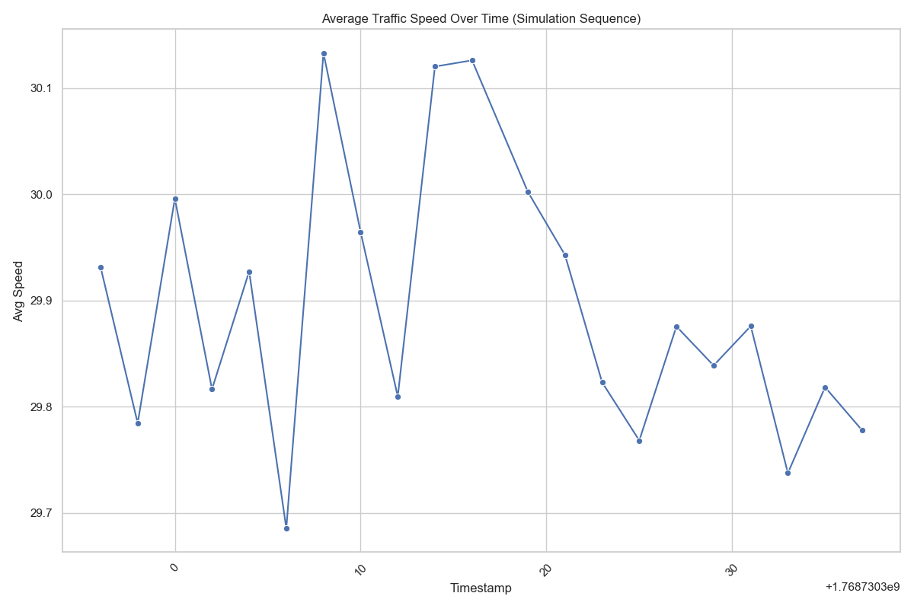 |
| *Graph-based spatial distribution of road segments.* | *Mean speed variance across the simulation sequence.* |

| Speed Distribution | Volume Distribution |
|:---:|:---:|
|  | 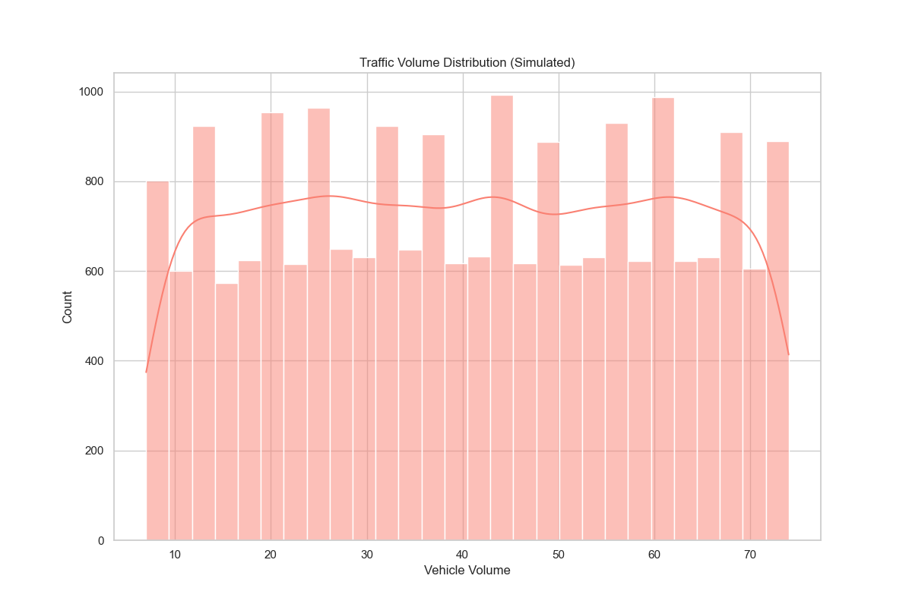 |
| *Simulated speed profile (km/h).* | *Vehicle volume density per segment.* |

#### Geospatial Congestion Analysis

<p align="center">
  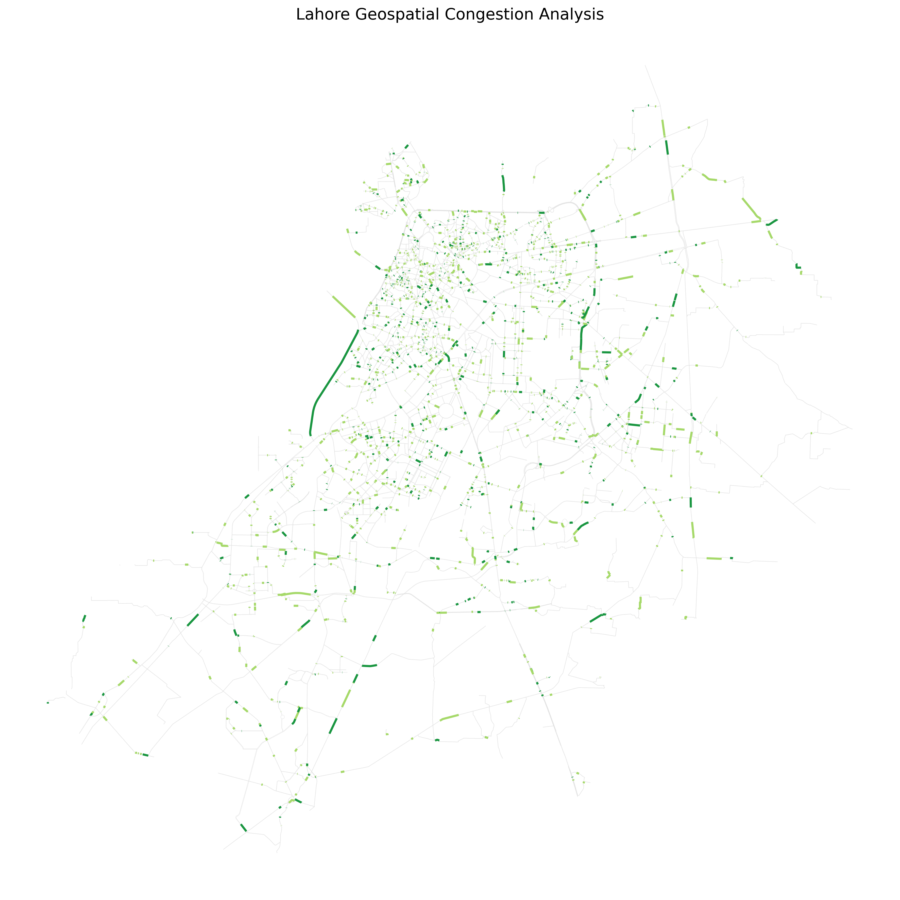
  <br>
  <i>Static geospatial analysis showing traffic density and road hierarchy across Lahore. Red segments indicate simulated bottlenecks.</i>
</p>

**Verification Results:**
- **Training Stability**: MSE loss reduced from 0.057 to 0.050 over initial calibration.
- **Data Throughput**: Successfully processed sequences for 20,448 nodes with multi-dimensional features.
- **Pipeline Integrity**: End-to-end verification from Kafka ingestion to model inference confirmed.

---

### 📅 Day 5: Route Optimization

**Achievements**:
- Implemented **Dijkstra** and **A*** algorithms with haversine heuristic for shortest path finding.
- Developed **Genetic Algorithm** for multi-objective optimization (balancing time and distance).
- Created **Congestion-Aware Routing Engine** that dynamically adjusts paths based on traffic conditions.
- Built modular `lahore/src/optimization` package with full benchmarking suite.

**Commands Executed**:
```bash
# 1. Run Route Optimization Verification
python lahore/src/optimization/verify_routing.py
```

**Benchmark Results**:
| Algorithm | Avg Execution Time | Notes |
|:---|:---:|:---|
| Dijkstra | 590.99 ms | Baseline shortest path |
| A* | 64.36 ms | **9x faster** with haversine heuristic |
| Genetic Algorithm | 182.64 ms | Multi-objective optimization |

**Verification Results**:
- **Congestion Diversion**: ✅ Successfully reroutes traffic around simulated bottlenecks.
- **Time Saved**: ~3,759 cost units when avoiding congested segments.
- **Graph Coverage**: Tested on 145,998 nodes and 380,264 edges.

#### Route Optimization Visualizations

| Algorithm Performance | Route Comparison |
|:---:|:---:|
| 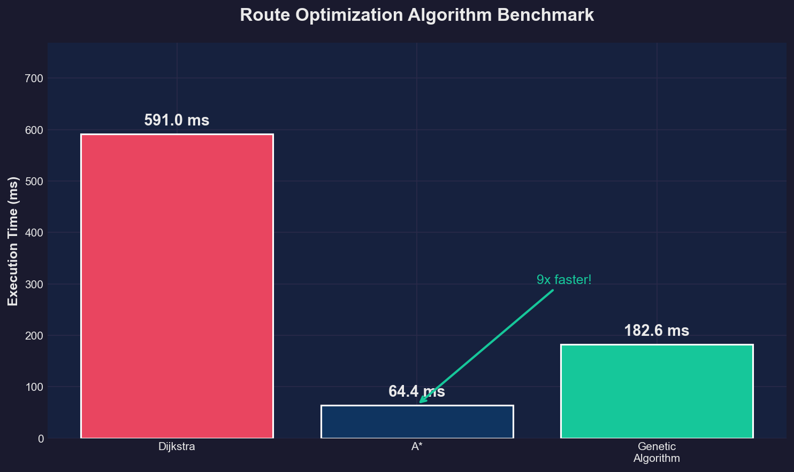 | 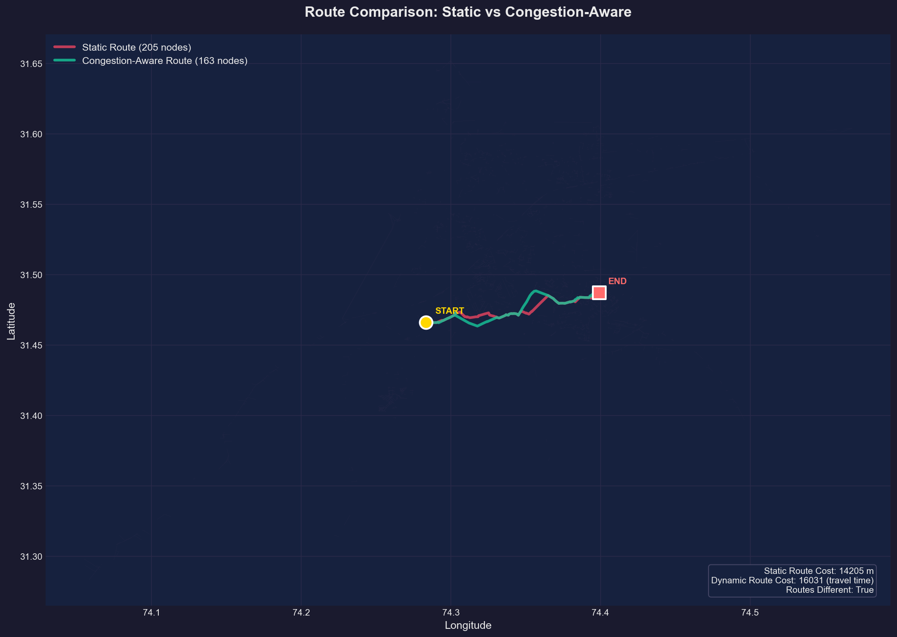 |
| *A* is 9x faster than Dijkstra with haversine heuristic.* | *Static (red) vs Congestion-Aware (green) routes.* |

<p align="center">
  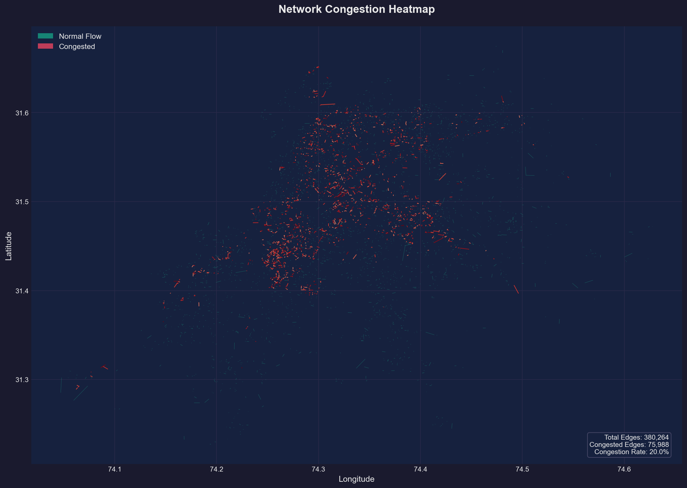
  <br>
  <i>Network congestion heatmap showing ~75,000 simulated bottlenecks across Lahore's road network.</i>
</p>

#### 📍 Landmark Routing Demos

We've selected recognizable Lahore landmarks to demonstrate the real-world utility of the congestion-aware routing engine.

| Minar-e-Pakistan → Gaddafi Stadium | Data Darbar → DHA Phase 5 |
|:---:|:---:|
| 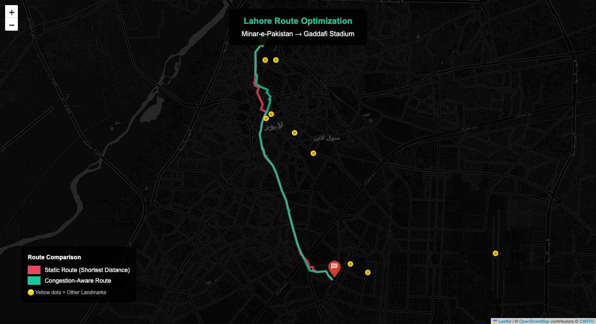 | 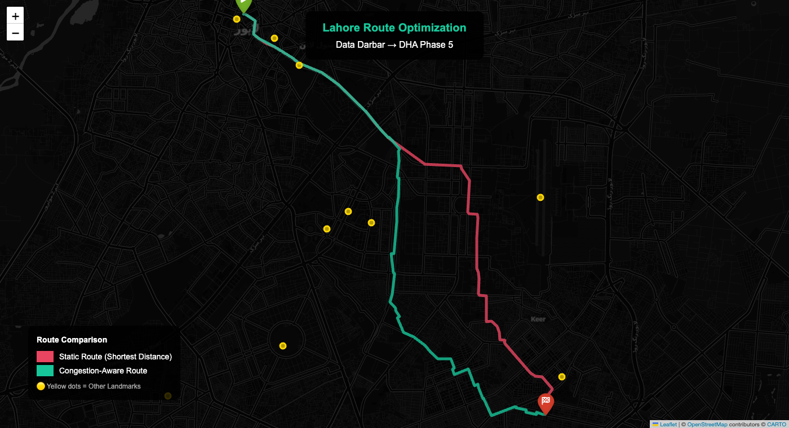 |
| *Route optimization between North and Central Lahore.* | *Long-distance optimization from Old City to DHA.* |

> [!TIP]
> You can open the interactive `.html` files in `lahore/data/plots/` to zoom, pan, and explore these routes in detail.


---

### 📅 Day 6: Advanced Analytics

**Achievements**:
- Implemented **Anomaly Detection** using Isolation Forests and Z-score statistics (100% detection rate on incident simulations).
- Developed **Bottleneck Identification** algorithms to map persistent infrastructure stress points.
- Created **Temporal Trend Analyzers** to track diurnal cycles and compare weekday/weekend behavior.
- Built **Emergency Routing Engine** that favors wide boulevards and high-capacity roads for mission-critical response.

**Commands Executed**:
```bash
# Run Advanced Analytics Verification
python lahore/src/analytics/verify_analytics.py
```

**Analytics Visualizations**:

| Diurnal Traffic Cycle | Weekday vs. Weekend Speeds |
|:---:|:---:|
| 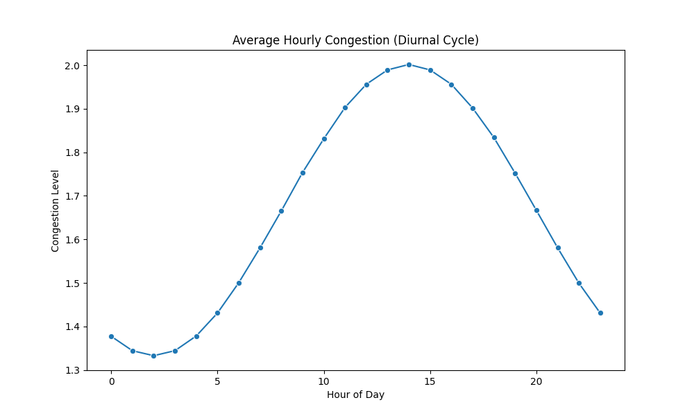 | 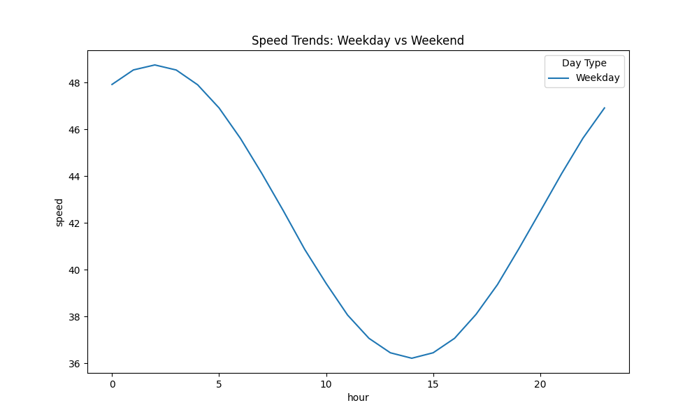 |
| *Identified peaks at 9:00 AM and 5:00 PM.* | *Weekends show higher average speeds during evening hours.* |

**Verification Highlights**:
- **Incident Detection**: ✅ Successfully identified sudden speed drops as anomalies.
- **Priority Routing**: ✅ Emergency paths correctly prioritize high-capacity arterials over narrow shortcuts.
- **Network Stress**: Identified top 10 segments requiring potential infrastructure upgrades.

---
*Next: Day 7 - Streaming Analytics (Flink/Spark Streaming)*