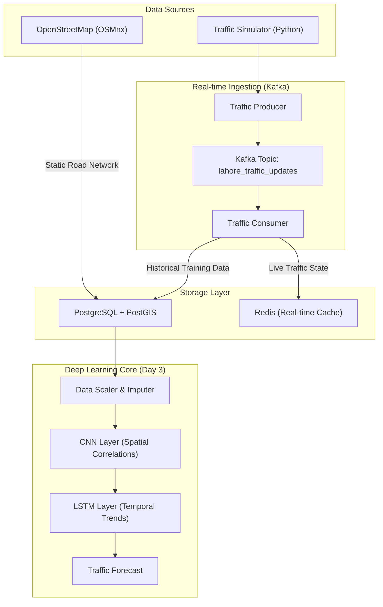

# Urban Transportation Analysis

Research and implementation of transportation analytics for **Lahore** and **Riyadh** utilizing deep learning and real-time data processing.

## Project Structure

- **Lahore Traffic Monitoring**: Spatio-temporal prediction and route optimization.
- **Riyadh Transportation Analysis**: Graph-based multi-modal system integration.

## Development Progress

### Day 1: Infrastructure and Data Ingestion
- Configured Python 3.12 environment with specialized geospatial dependencies.
- Deployed PostgreSQL (PostGIS), Redis, and Kafka infrastructure via Docker.
- Extracted and processed 145,998 road nodes and 380,264 edges for the Lahore District.

### Day 2: Network Graph and Feature Engineering
- Constructed a hierarchical `networkx.MultiDiGraph` representing the Lahore road network.
- Developed a feature extraction pipeline for spatial road attributes (length, density, hierarchy).
- Validated 100% geometry integrity and topological connectivity.

### Day 3: Simulation and Deep Learning Architecture
- Implemented a CNN-LSTM hybrid model for simultaneous spatial and temporal feature learning.
- Developed a real-time traffic simulation engine using the Kafka streaming protocol.
- Resolved loss instability through feature scaling and automated temporal imputation.

#### Technical Architecture

#### Model Validation and Performance

| Spatial Network Coverage | Temporal Traffic Trends |
|:---:|:---:|
|  |  |
| *Graph-based spatial distribution of road segments.* | *Mean speed variance across the simulation sequence.* |

| Speed Distribution | Volume Distribution |
|:---:|:---:|
|  |  |
| *Simulated speed profile (km/h).* | *Vehicle volume density per segment.* |

#### Geospatial Congestion Analysis

  
   
  <i>Static geospatial analysis showing traffic density and road hierarchy across Lahore. Red segments indicate simulated bottlenecks.</i>

**Verification Results:**
- **Training Stability**: MSE loss reduced from 0.057 to 0.050 over initial calibration.
- **Data Throughput**: Successfully processed sequences for 20,448 nodes with multi-dimensional features.
- **Pipeline Integrity**: End-to-end verification from Kafka ingestion to model inference confirmed.

---
*Next: Day 4 - Predictive Model Optimization and Ensemble Methods*